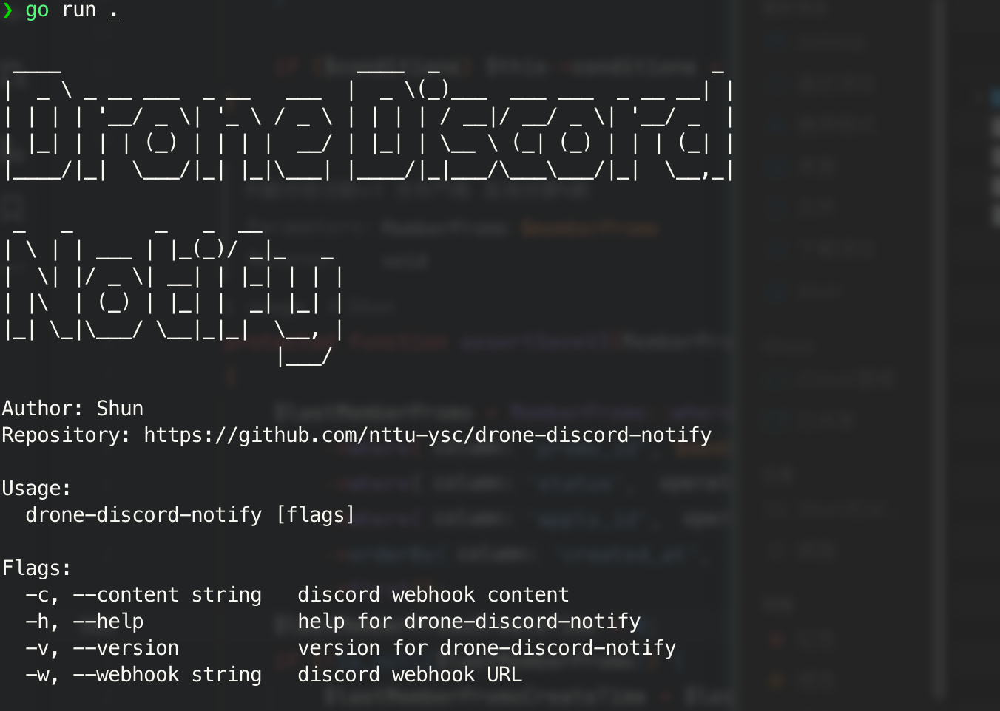

# Drone Discord Notify

Drone Discord Notify is a simple tool that allows you to send deployment results from Drone CI directly to a Discord channel via a webhook.

- [Github](https://github.com/nttu-ysc/drone-discord-notify)
- [Docker Hub](https://hub.docker.com/r/shundevhub/drone-discord-notify)



## Integration with Drone CI

To send deployment results to Discord, you can integrate this tool into your Drone CI pipeline by adding a step to run the `drone-discord-notify` command.
```yml
kind: pipeline
name: Drone ci

steps:
- name: discord notify
    image: shundevhub/drone-discord-notify
    settings:
      discord_webhook_url:
        from_secret: YOUR_WEBHOOK_URL
    when:
      status:
        - success
        - failure
```

## Development

### Installation
To install the package, you can clone the repository and build the binary:

```bash
git clone https://github.com/nttu-ysc/drone-discord-notify.git
cd drone-discord-notify
go build -o drone-discord-notify
```

### Example

```bash
drone-discord-notify \
-w https://discord.com/api/webhooks/... \
-c "@everyone"
```
